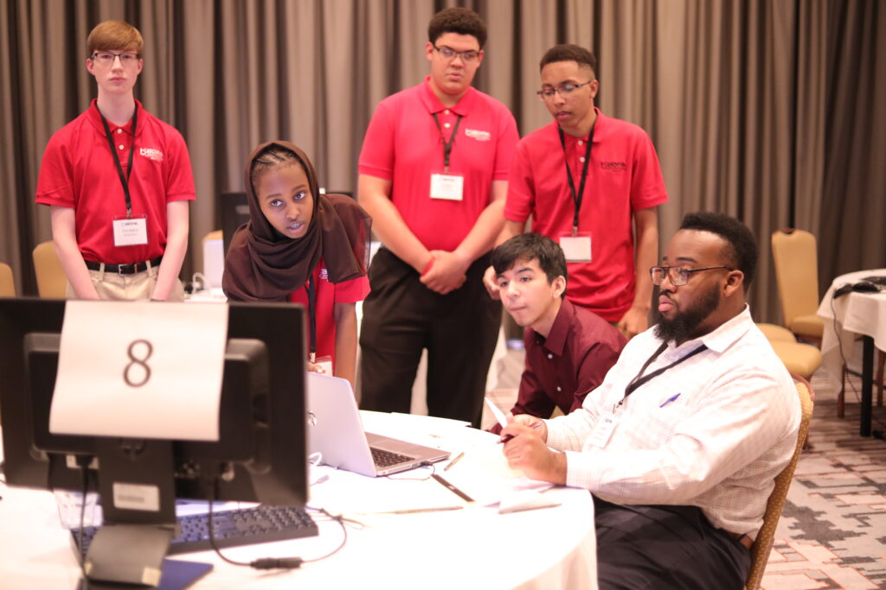

# National BDPA High School Computer Competition Specification

> The key words "MUST", "MUST NOT", "REQUIRED", "SHALL", "SHALL NOT", "SHOULD",
> "SHOULD NOT", "RECOMMENDED", "MAY", and "OPTIONAL" in this document, when
> appearing in uppercase, are to be interpreted as described in
> [RFC 2119](https://www.ietf.org/rfc/rfc2119.txt).

This document details a general blueprint and current best practices for running
the Black Data Processing Association's (BDPA) national High School Computer
Competition (HSCC).

## Contents

- [What Is The High School Computer Competition?](#what-is-the-high-school-computer-competition)
- [Guiding Principles](#guiding-principles)
  - [Solving Problem Statements (PS1) Is a Chapter-Wide Effort](#solving-problem-statements-ps1-is-a-chapter-wide-effort)
  - [Problem Statements Are Modern and Realistic](#problem-statements-are-modern-and-realistic)
  - [Problem Statements Foster Community Between HSCC/SITES Students](#problem-statements-foster-community-between-hsccsites-students)
- [Actors](#actors)
  - [HSCC National Team](#hscc-national-team)
    - [Chief Judge](#chief-judge)
    - [Quizmaster](#quizmaster)
  - [Judge](#judge)
  - [Student](#student)
  - [Competition Team](#competition-team)
  - [Coordinator](#coordinator)
  - [Coach, Chaperone, or Parent](#coach-chaperone-or-parent)
- [Layout](#layout)
  - [Pre-Conference Phase](#pre-conference-phase)
    - [Fully Virtual vs Hybrid](#fully-virtual-vs-hybrid)
  - [Phase 1: The Release of Problem Statement 1 (PS1)](#phase-1-the-release-of-problem-statement-1-ps1)
  - [Phase 2: The Release of Problem Statement 2 (PS2)](#phase-2-the-release-of-problem-statement-2-ps2)
  - [Phase 3: Standard Examination](#phase-3-standard-examination)
  - [Phase 4: Team Presentations](#phase-4-team-presentations)
  - [Post-Competition Phase](#post-competition-phase)
    - [Score Calculation](#score-calculation)
- [Rules](#rules)
- [Judging](#judging)
  - [Selecting Judges](#selecting-judges)
  - [Training Judges](#training-judges)
  - [Solution Review](#solution-review)
- [Threat Model](#threat-model)

## What Is The High School Computer Competition?

Throughout the year, [local BDPA chapters](https://bdpa.org/about-us) conduct
[SITES training programs](https://bdpa.site-ym.com/page/Student_Programs) for
the youth in their communities. These programs are designed to expose students
to a variety of Computer Science and IT concepts from complex software
engineering and web design challenges to database administration, project
management, graphic and interface design, and supervision of deployments in
production.

[Once a year](https://bdpa.site-ym.com/page/PastBDPAConferences), chapters
select their most capable students to compete in the
[_High School Computer Competition_ (HSCC)](https://2021.bdpa.org/hscc). The
HSCC is similar to a design-sprint or hackathon where student teams are given a
real-world scenario—a
[_problem statement_](https://github.com/nhscc/problem-statements)—and must
collaborate intensively over a several week period to create a functioning
software _solution_ to it. The competition concludes at BDPA's
[national conference](https://bdpa.site-ym.com/page/PastBDPAConferences), where
teams must further extend their solutions and pitch the totality of their work
to a panel of judges. Teams are evaluated based on how well their solution
satisfies the problem statement, how well they can justify their design
decisions to the judges, and other competition criteria.

In the end, winning teams' students are each awarded hundreds to _thousands_ of
dollars in scholarships.

> From: 2016 High School Computer Competition. _Advancing Careers From The
> Classroom To The Boardroom._

## Guiding Principles

When running the competition and especially when coming up with a new problem
statement, there are three guiding principles to keep in mind:

### Solving Problem Statements (PS1) Is a Chapter-Wide Effort

Only a chapter's current students are allowed to physically _code_ their problem
statement (PS1) solution. This means even students that are not part of a
chapter's official competition team, _including students that would normally be
too young to compete_, can help write solution code so long as they are active
in the chapter's training program.

This also means chaperones, coordinators, and teachers/coaches are free to
assist students in any capacity so long as they are not actually _writing_
solution code. Coaches can observe, make suggestions, explain algorithms, answer
_any_ questions students might have, and even _teach the contents of the problem
statement itself_ as part of their training program. In this way, solving the
problem statement (PS1) could involve the whole chapter. This is encouraged!

### Problem Statements Are Modern and Realistic

Problem statements must be realistic and _current_. Students should come out of
their respective SITES/HSCC program having developed the confidence and domain
expertise necessary to pursue their own software-based entrepreneurial ambitions
or a build a career in industry.

### Problem Statements Foster Community Between HSCC/SITES Students

HSCC might be a "competition," but it is paramount students learn about and
network with each other—_the future of computer science_! Any problem statement
must be designed with this in mind. For instance: students from different teams
might notice one another's presence when interacting with a problem statement's
[globally available backing store](https://github.com/nhscc/ghostmeme.api.hscc.bdpa.org).

## Actors

There are several actors involved at various phases throughout the competition.
The roles of certain actors (like judges) can change depending on if the
competition is [fully virtual or hybrid](#fully-virtual-vs-hybrid).

### HSCC National Team

The HSCC national team is responsible for running the competition portion of the
national conference and includes the [chief judge](#chief-judge),
[quizmaster](#quizmaster), and other vital officials.

#### Chief Judge

The chief judge ensures the smooth operation of the entire competition.
Responsibilities include: drafting, managing, and releasing problem statements;
answering or redirecting any questions from other actors; determining
student/team participation eligibility; awarding extensions/allowances when
extenuating circumstances occur; crafting and enforcing competition rules;
onboarding and supporting judges at various points throughout the competition;
ensuring final scores are calculated fairly; ensuring judges are not partial to
any particular team; ensuring judges do not skew the final score distribution
for invalid reasons.

#### Quizmaster

The quizmaster is responsible for setting up, answering questions about, and
enforcing the rules around the
[Standard Examination](#phase-3-standard-examination).

### Judge

Judges are tasked with evaluating teams' solutions, receiving teams'
presentations, and,
[if the conference is not virtual](#fully-virtual-vs-hybrid), observing how team
members interact and work together to come up with a solution. Judges can also
issue demerits for rule violations at any point during the competition
(including the run up _before_ the national conference), such as for rude
behavior or failure to turn in paperwork on time.

Judges do not have to be BDPA members.

### Student

A student is a current member of a local BDPA chapter and SITES training program
participant, is fully registered, and is planning to compete in the HSCC as part
of a [competition team](#competition-team). Students can also participate in
other events at the national conference, such as
[YTC workshops](https://bdpa.site-ym.com/page/YTC).

Students must be members of their local chapters.

### Competition Team

A competition team is composed of several [students](#student) from the same
local chapter. Competition teams, rather than individual students, compete
against each other in the HSCC.

### Coordinator

A coordinator is the primary point of contact between the
[national team](#hscc-national-team) and a chapter. Coordinators are expected to
attend _coordinator meetings_ (usually held monthly in the lead up to the
competition), have ultimate responsibility for the behavior of their teams for
the duration of the national conference, remain abreast of announcements and
information related to HSCC (usually disseminated over Slack and email), and
ensure their [competition teams](#competition-team) submit their solutions on
time.

Note that a chapter's coordinator can play the dual role of chapter president,
[coach](#chaperone-coach-or-parent), or even [_student_](#student).

### Coach, Chaperone, or Parent

A coach/parent or other volunteer is a person associated with a chapter and
attending the national conference who also takes responsibility for the behavior
of their team. When [non-virtual](#fully-virtual-vs-hybrid), this actor is
responsible for shuttling their students to and from their hotel rooms,
supervising activity outside of the competition space (including taking their
students out to eat), escorting students to and from the washroom when
necessary, reporting any rule infractions or violations to the judges, and
ensuring their students have fun.

Coaches, chaperones, and/or parents do not necessarily have to be BDPA members.

## Layout

### Pre-Conference Phase

#### Fully Virtual vs Hybrid

### Phase 1: The Release of Problem Statement 1 (PS1)

### Phase 2: The Release of Problem Statement 2 (PS2)

### Phase 3: Standard Examination

### Phase 4: Team Presentations

### Post-Competition Phase

#### Score Calculation

## Rules

1. A chapter can send at most `1` teams
2. Teams are allowed

## Judging

### Selecting Judges

### Training Judges

### Solution Review

## Threat Model
